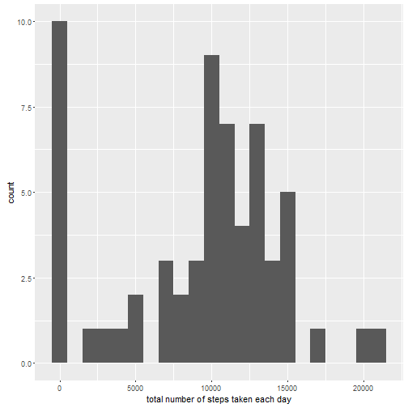
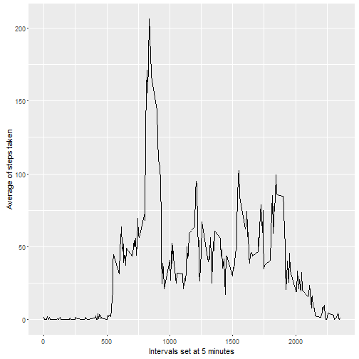
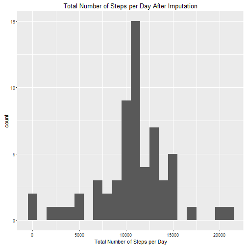
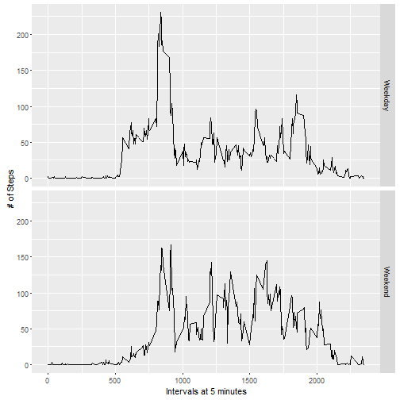

# Reproducible Research: Peer Assessment 1

## Loading and Preprocessing the data

```r
df.1 <- read.csv("activity.csv")
library(ggplot2)
library(xtable)
library(psych)
df <-read.csv("activity.csv")
df.steps <- tapply(df$steps, df$date, FUN=sum, na.rm=TRUE)
```

## What is mean total number of steps taken per day?
Ignoring the missing values in the data set

#### 1. Make a histogram of the total number of steps taken each day

```r
qplot(df.steps, binwidth=1000, xlab="total number of steps taken each day")
```

 
#### 2. Calculate and report the mean and median total number of steps taken per day.

```r
mean(df.steps, na.rm=TRUE)
```

```
## [1] 9354.23
```

```r
median(df.steps, na.rm=TRUE)
```

```
## [1] 10395
```

## What is the average daily activity pattern?

#### 1. Make a time series plot of the 5-minute interval and the average number of steps taken averaged across all days.

```r
df.averages <- aggregate(x=list(steps=df$steps), by=list(interval=df$interval), FUN=mean, na.rm=TRUE)
ggplot(data=df.averages, aes(x=interval, y=steps)) + geom_line() + 
xlab("Intervals set at 5 minutes") + ylab("Average of steps taken")
```

 
#### 2. Which 5-minute interval, on average across all the days in the dataset, contains the maximum number of steps?

```r
df.averages[which.max(df.averages$steps),]
```

```
##     interval    steps
## 104      835 206.1698
```

## Imputing missing values
The presence of the missing days may introduce bias into some calculations or summaries of the data.

##### 1. Calculate and report the total number of missing values in the dataset

```r
df.missing <- is.na(df$steps)
num.missing <- sum(df.missing)
table(df.missing)
```

```
## df.missing
## FALSE  TRUE 
## 15264  2304
```

```r
table (num.missing)
```

```
## num.missing
## 2304 
##    1
```
##### 2. Devise a strategy for filling in all of the missing values in the dataset. The strategy does not need to be sophisticated.

These missing values will be filled in with the mean value of that respective 5-minute interval.

##### 3. Create a new dataset that is equal to the original dataset but with the missing data filled in. 

```r
nafiller <- function(steps, interval){
  filler <- NA
  if (!is.na(steps))
    filler <- c(steps)
  else
    filler <- (df.averages[df.averages$interval==interval, "steps"])
  return(filler)
}
myfill.df <- df
myfill.df$steps <- mapply(nafiller, myfill.df$steps, myfill.df$interval)
```
##### 4. Make a histogram of the total number of steps taken each day

```r
myhist <- tapply(myfill.df$steps, myfill.df$date, FUN = sum)
qplot(myhist, binwidth=1000, xlab="Total Number of Steps per Day",
      main="Total Number of Steps per Day After Imputation" )
```

 
##### Calculate and report the mean and median total number of steps taken per day.

```r
mean(myhist)
```

```
## [1] 10766.19
```

```r
median(myhist)
```

```
## [1] 10766.19
```

```r
summary(myhist)
```

```
##    Min. 1st Qu.  Median    Mean 3rd Qu.    Max. 
##      41    9819   10770   10770   12810   21190
```

#### Do these values differ from the estimates from the first part of the assignment?  What is the impact of imputing missing data on the estimates of the total daily number of steps?
Mean and median are higher after imputing the missing data.  
The total number of steps taken in days with NA values are set to 0 by default.  
So by replacing these missing values with the mean of their associated interval, these 0s are removed from the data.
This impacts the data by increasing the estimates of the total daily number of steps consequently increasing the mean and median values.

## Are there differences in activity patterns between weekdays and weekends?

Using the filled-in data set, we have to look at the day of the week for every single measurement in the data.

##### 1. Create a new factor variable in the dataset with two levels – “weekday” and “weekend” indicating whether a given date is a weekday or weekend day.

```r
week.identify <- function(date){
 day <- weekdays(date)
 if (day %in% c("Monday", "Tuesday", "Wednesday", "Thursday", "Friday"))
   return("Weekday")
 else if (day %in% c("Saturday", "Sunday"))
   return("Weekend")
 else
   stop("Invalid Date")
}  
myfill.df$date <- as.Date(myfill.df$date)
myfill.df$day <- sapply(myfill.df$date, FUN=week.identify)

head(myfill.df$day)
```

```
## [1] "Weekday" "Weekday" "Weekday" "Weekday" "Weekday" "Weekday"
```
##### 2. Make a panel plot containing a time series plot

```r
avg <- aggregate(steps ~ interval + day, data=myfill.df, mean)
ggplot(avg, aes(interval, steps))+geom_line()+ facet_grid(day ~ .) + xlab("Intervals at 5 minutes") + ylab("# of Steps")
```

 
